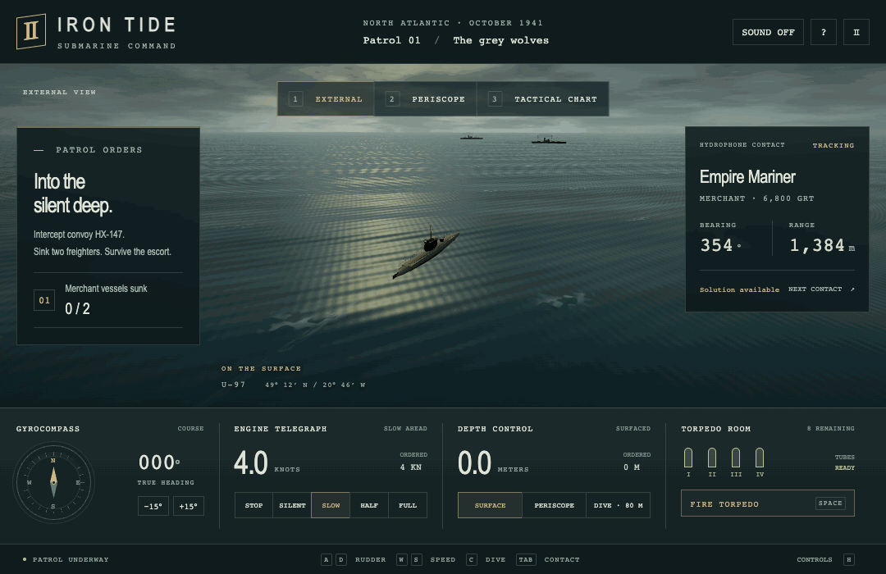
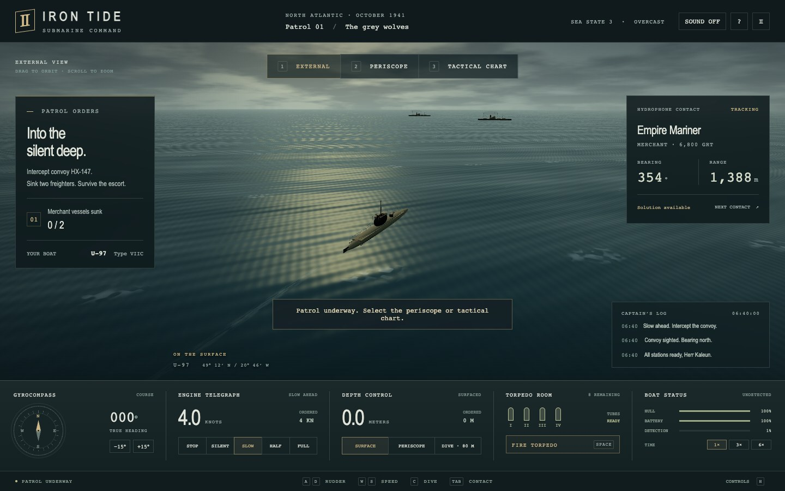
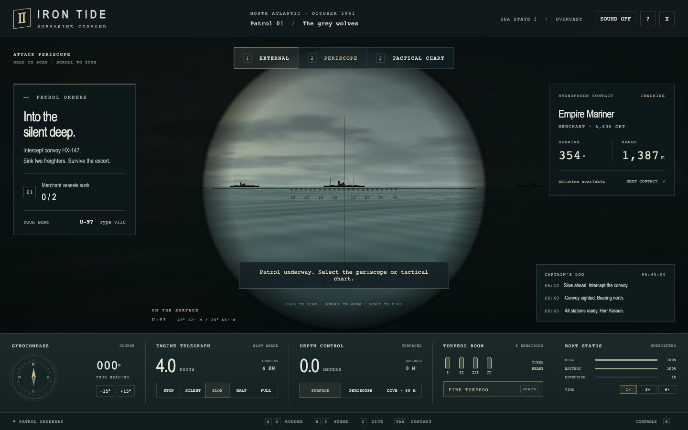
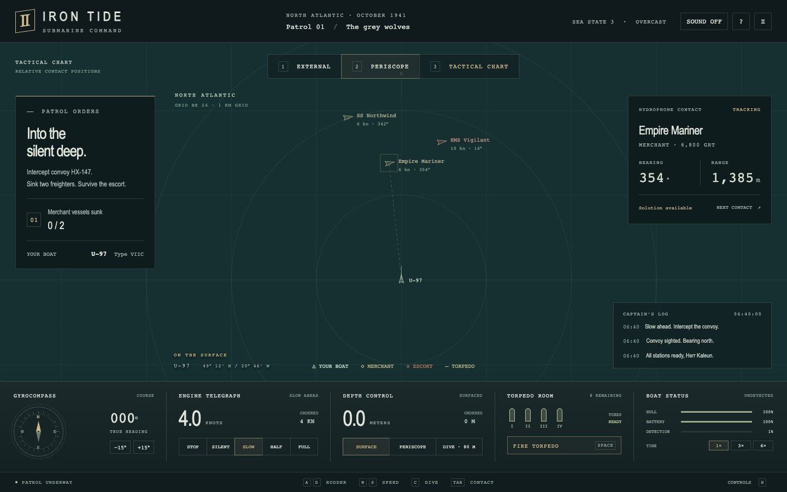
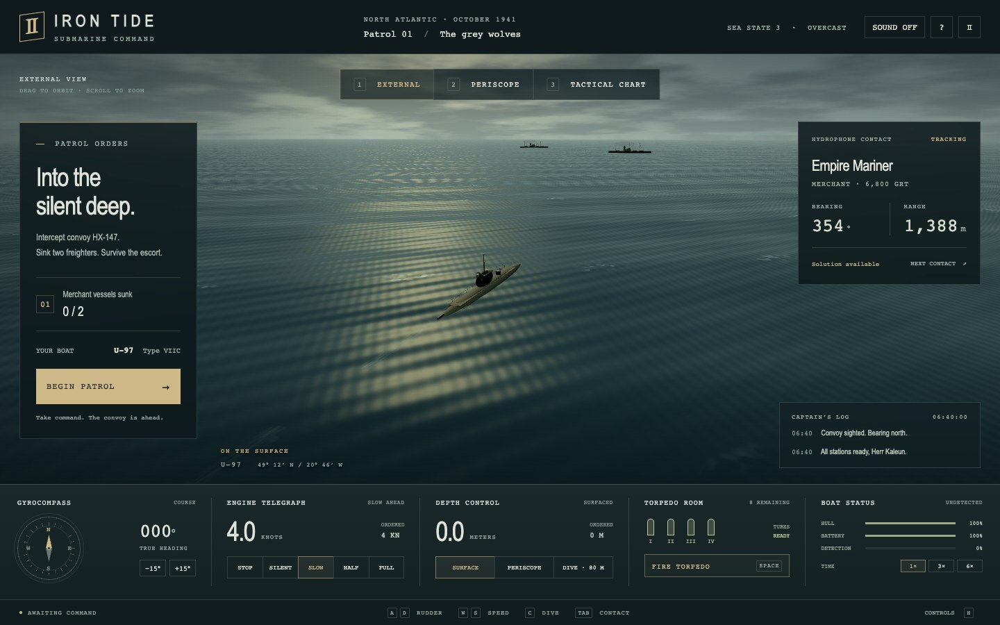

# IRON TIDE — Atlantic Patrol

Command a WWII-inspired submarine in a 3D North Atlantic patrol. Track a convoy, line up a torpedo attack, and dive to escape its escort. Inspired by the atmosphere of classic submarine games such as **Silent Hunter**.


**To play:** clone the repo, serve `dist/`, and open **http://127.0.0.1:5173**. Requires Python 3 and a browser with WebGL enabled.

```bash
git clone https://github.com/eforus-overseer/iron-tide-submarine.git
cd iron-tide-submarine
python3 -m http.server 5173 --bind 127.0.0.1 --directory dist
```



*Captured in-game — a surface patrol followed by the attack periscope and tactical chart. Playback is condensed.*

## Gallery

| | |
|---|---|
|  **External view** — orbit the boat above a procedural ocean. |  **Attack periscope** — scan the horizon and track your selected contact. |
|  **Tactical chart** — plot relative positions, headings, and range. |  **Patrol briefing** — your boat, orders, and instruments before departure. |

*All images are captured from the running game.*

## Your first patrol

Press **BEGIN PATROL** to intercept convoy HX-147. Sink **Empire Mariner** and **SS Northwind**, survive **HMS Vigilant**, and reduce detection below **20%** to complete the mission.

1. Use the tactical chart to find the convoy and select a merchant contact.
2. Close to within **2,400 m**, slow to **8 knots or less**, and stay at **14 m depth or shallower**.
3. Point the bow within **40°** of the target and fire. Fire control calculates the lead; torpedoes run straight.
4. Dive and run silently to evade the escort. Watch hull integrity, battery charge, and detection; surface to recharge.

Eight torpedoes, four tubes, and an escort that can hunt you with depth charges. Movement and weapon travel are accelerated for a shorter patrol; progress lasts for the current session.

## Controls

| Key | Action |
|---|---|
| `W` / `S` | Increase / decrease ordered speed |
| `A` / `D` | Steer port / starboard |
| `1` / `2` / `3` | External / periscope / tactical chart |
| `Tab` | Cycle contacts |
| `Space` | Fire a torpedo |
| `C` / `R` | Dive to 80 m / rise to periscope depth |
| `P` / `H` | Pause / open controls |
| Drag / scroll | Orbit or scan / zoom |

On-screen controls also cover the primary orders, sound, and time compression.

## Inside the game

- **Procedural fleet** — submarine, merchant ships, and destroyer built from geometry.
- **Atlantic atmosphere** — animated ocean and sky shaders, wakes, and fog.
- **Convoy combat** — moving-target interception, tube reloads, escort pursuit, depth charges, and damage.
- **Three command views** — external camera, attack periscope, and a canvas tactical chart.
- **Shipboard instruments** — course, speed, depth, hull, battery, detection, and contact readouts.

## Run and explore

The game is a static site with a vendored copy of Three.js. It needs no package installation, build step, or CDN connection. With Node.js and Python 3 installed, `npm start` runs the same local server shown above.

```text
dist/
├── index.html              # Game interface and controls
├── style.css               # Instrument panels and visual styling
├── game.js                 # Models, shaders, simulation, and input
└── vendor/
    ├── three.module.js     # Local Three.js dependency
    └── THREE-LICENSE.txt   # Three.js MIT license
docs/media/                 # In-game README screenshots and animation
```

JavaScript syntax checks and a browser capture pass cover startup and switching between all three views. These captures are not a full mission playthrough.

## Credits

An original browser-scale submarine game inspired by classic WWII naval simulators. **Silent Hunter** is a reference for inspiration; this project is independent and unaffiliated with that series.

Rendering uses Three.js; its MIT license is included in [`dist/vendor/THREE-LICENSE.txt`](dist/vendor/THREE-LICENSE.txt).
